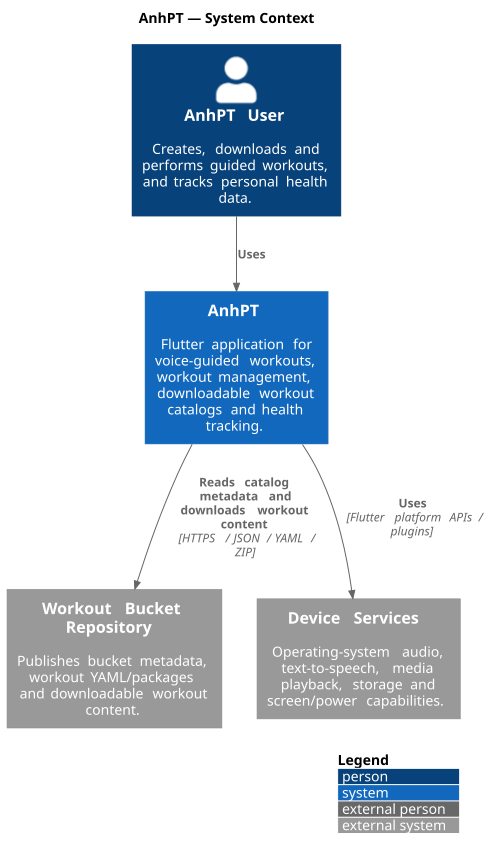
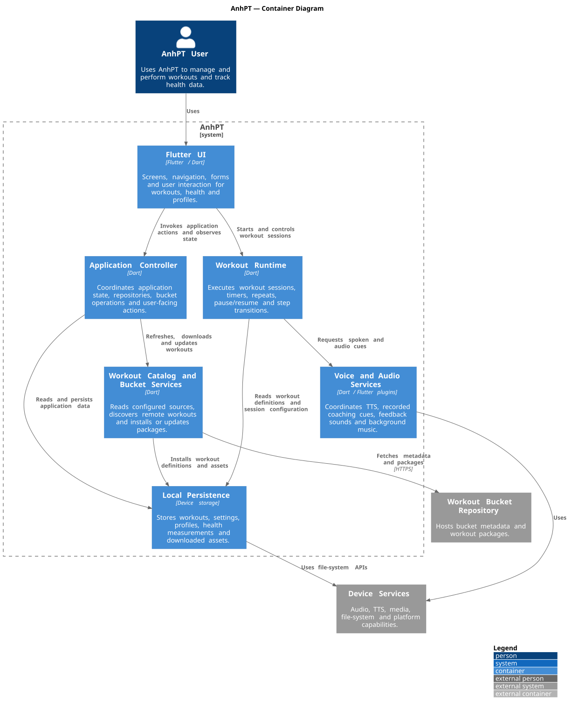
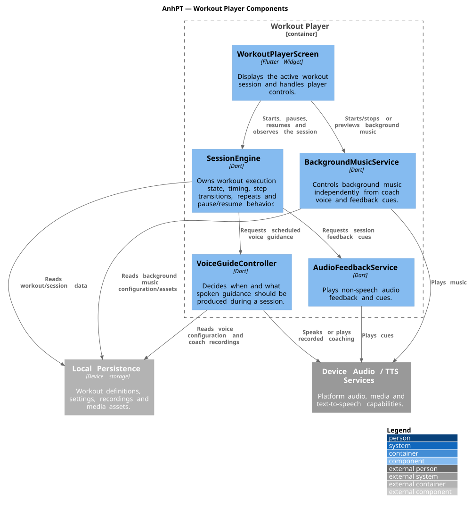
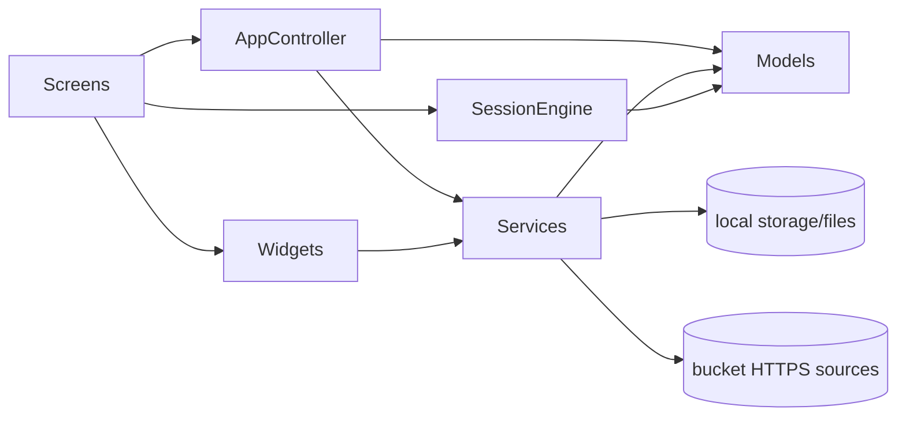

# AnhPT Architecture and Code Documentation

This directory documents the architecture and the **current implementation structure** of AnhPT. The documentation is versioned with the code and is intended for both human maintainers and AI coding agents.

The C4 diagrams provide stable architectural maps. The Markdown documents describe how the current Dart/Flutter implementation actually works.

## Start here

| Document | Use it to understand |
| --- | --- |
| [`codebase-overview.md`](codebase-overview.md) | Source directories, state ownership, dependencies, main screens and where changes belong. |
| [`workout-domain.md`](workout-domain.md) | `Workout`, steps/repeats, exercises/media references, voice configuration and YAML boundaries. |
| [`workout-runtime.md`](workout-runtime.md) | `SessionEngine`, voice/audio coordination, step progression, pause/resume and timing announcements. |
| [`storage-and-media.md`](storage-and-media.md) | `LocalStore`, `HealthStore`, files, recordings, music, demo media, YAML mirror and startup migrations. |
| [`catalog-and-packages.md`](catalog-and-packages.md) | Bucket sources/catalogs, package download/import/export, provenance and update/install behavior. |
| [`health-and-profiles.md`](health-and-profiles.md) | Multi-profile health persistence, migration, active profile and measurement ownership. |
| [`ci-and-release.md`](ci-and-release.md) | Flutter CI, APK release rules, PlantUML rendering and branch cleanup. |

## C4 diagrams

### System context

Source: [`context.puml`](context.puml)

### Containers / major responsibilities

Source: [`containers.puml`](containers.puml)

### Workout player components

Source: [`workout-player-components.puml`](workout-player-components.puml)

## Documentation roles

Use each documentation type for a different question:

| Question | Documentation |
| --- | --- |
| What systems and external actors are involved? | C4 System Context |
| What are the major architectural responsibilities? | C4 Container diagram |
| Which components collaborate to run a workout? | C4 Workout Player component diagram + `workout-runtime.md` |
| What does the current Dart code actually own? | `codebase-overview.md` and feature-specific architecture docs |
| What is the workout/YAML data model? | `workout-domain.md` |
| How is data persisted or migrated? | `storage-and-media.md` / `health-and-profiles.md` |
| How do downloadable workouts work? | `catalog-and-packages.md` |
| How do CI and releases work? | `ci-and-release.md` |
| How does a user navigate between screens? | Mermaid in `docs/ux/` |
| What should an individual screen contain? | UI documentation in `docs/ux/` |
| How does project work move through GitHub? | `docs/project-management.md` |

## Current implementation shape

The current code is pragmatic rather than a strict clean-architecture implementation:

Two state owners are especially important:

- `AppController` owns long-lived application collections and coordinates persistence/services.
- `SessionEngine` owns the state machine and timing of one running workout.

Avoid moving session progression rules into screens or audio services. Avoid making `SessionEngine` responsible for persistence, UI, networking, or media libraries.

## AI-agent workflow

Before changing implementation behavior, an AI agent should:

1. Read `codebase-overview.md` and the relevant feature document.
2. Inspect the referenced Dart files before editing them.
3. Preserve existing persistence/migration behavior unless the task intentionally changes it.
4. Put behavior into the component that currently owns that responsibility.
5. Update the relevant documentation when a structural relationship, data model, YAML schema, persistence rule, or release workflow changes.
6. Run the relevant analyzer/tests before proposing a merge.

The documentation is a map, not a substitute for reading the changed source files.

## Keeping docs current

Update these docs in the same PR when changing:

- source directory responsibilities or major dependencies;
- workout model/YAML schema;
- session/voice runtime semantics;
- persistence keys, file ownership or migrations;
- bucket/package installation rules;
- health/profile ownership;
- GitHub Actions/release behavior.

PlantUML `.puml` files are source-of-truth diagrams. GitHub Actions renders matching SVG files so they can be embedded directly in Markdown.
