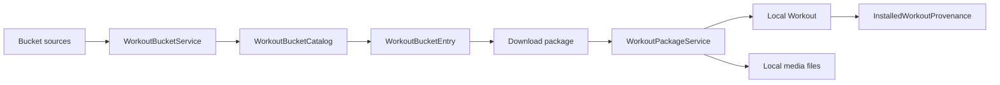
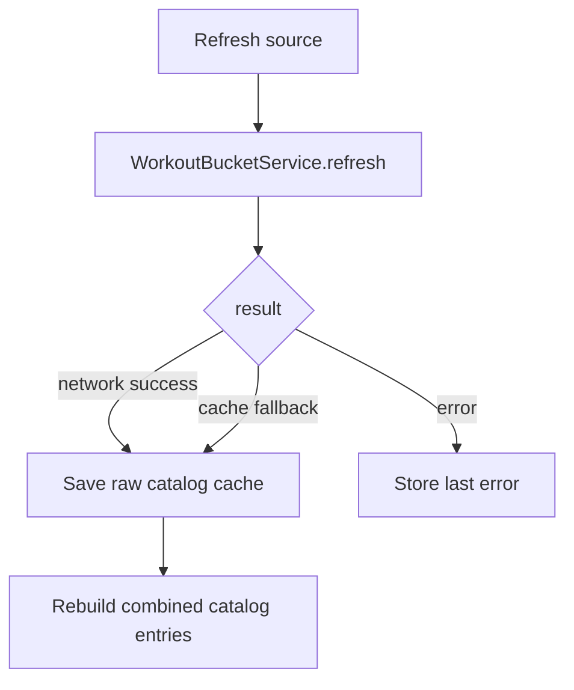
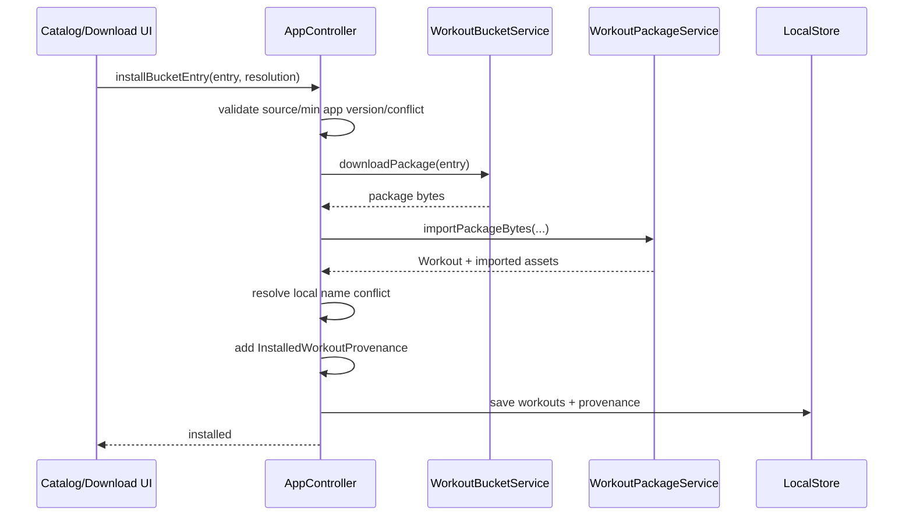
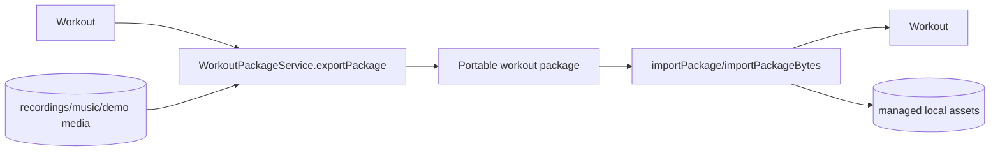

# Bucket Catalogs and Workout Packages

AnhPT can install workouts from remote bucket catalogs while keeping the resulting workout local and editable. Catalog metadata, package download, package import/export and local provenance are separate responsibilities.

## Main components

`AppController` orchestrates these services and exposes install/update state to the UI.

## Bucket sources

A `WorkoutBucketSource` represents a remote catalog URL plus local state such as enabled/disabled status, last refresh time, cached catalog JSON and the most recent error.

The official bucket is seeded once by `LocalStore` unless an equivalent source already exists.

Only enabled sources participate in catalog loading and refresh.

## Catalog refresh

`AppController.refreshBucketSource()` delegates network/cache behavior to `WorkoutBucketService`. On success it stores the returned raw catalog JSON on the source and rebuilds the combined in-memory catalog. If the service falls back to cached data, the source remains usable but records an offline status message.

Cached catalog JSON is stored with source configuration in `SharedPreferences`, so the application can rebuild a catalog without immediately requiring network access.

## Install state

For a remote entry, `AppController.bucketInstallState()` compares catalog identity and version against `InstalledWorkoutProvenance` records:

- `notInstalled`
- `installed`
- `updateAvailable`

Provenance tracks the local workout ID together with source ID/name, catalog entry ID/original name, version, package URL/hash and installation timestamp.

This lets the local workout have a different display name while still retaining its remote origin.

## Installing a bucket entry

If the same catalog entry is already installed, the caller must choose a conflict resolution. Current behavior supports keeping the local version or replacing it. Replacement removes the previous local workout/provenance before adding the newly imported copy.

The controller also checks `minAppVersion` before download/import. The installed
version is read from platform package metadata during `AppController.initialize()`;
it is not duplicated as a hard-coded application constant. If platform metadata
cannot be read, compatibility fails safely with an explicit version-detection
error instead of assuming an outdated version.

## Local naming

Remote package names do not have to be globally unique. After import, `AppController` computes a unique local workout name. This prevents one bucket installation from silently colliding with another local workout while provenance continues to preserve the remote identity.

## Package import/export

`WorkoutPackageService` is used both for direct local package import/export and bucket installation.

Conceptually a package contains the workout definition plus referenced local assets needed to reproduce the workout on another installation.

After import, `AppController` saves the workout and performs path normalization/migration so imported music and other managed files follow the same local conventions as native content.

## Security boundary

Catalog/package URLs are expected to be public HTTPS URLs. YAML media/audio sources are separately validated to prevent arbitrary absolute paths or path traversal. Package code should continue to treat external archive contents as untrusted input and resolve files only into managed application locations.

## Update behavior

A bucket-installed workout is still a normal local workout. Local edits may therefore diverge from the remote package. The UI can detect a newer remote version using provenance and catalog version information, then ask how to handle the installed copy rather than silently overwriting user changes.
