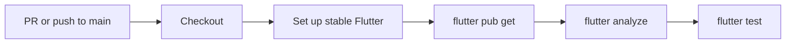
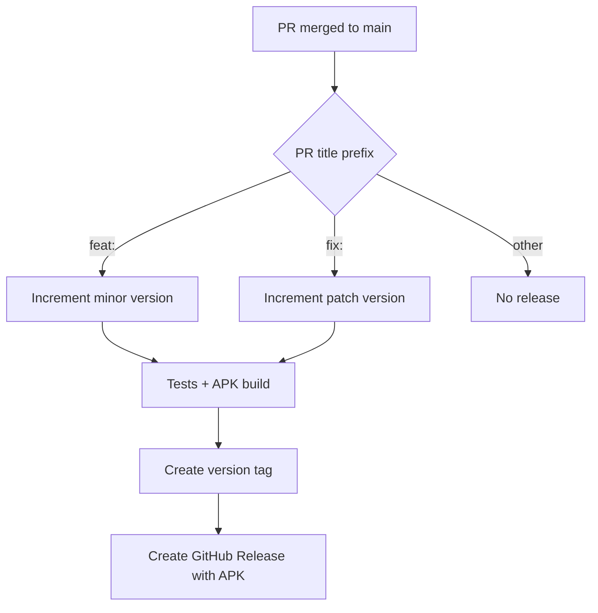

# CI and Release Automation

AnhPT currently uses GitHub Actions for Flutter verification, Android APK releases, PlantUML rendering, and merged-branch cleanup.

## Flutter CI

`.github/workflows/flutter-ci.yml` runs on:

- pull requests targeting `main`
- pushes to `main`

The job uses stable Flutter with dependency caching and performs:

```text
flutter pub get
flutter analyze --no-fatal-infos --no-fatal-warnings
flutter test
```



The analyzer currently does not fail CI on info/warning diagnostics because the workflow uses `--no-fatal-infos --no-fatal-warnings`. Errors still fail analysis. If the codebase is cleaned to zero warnings, this can later be tightened to plain `flutter analyze`.

## APK release trigger

`.github/workflows/release-apk.yml` runs when a pull request targeting `main` is closed, but the release job executes only when:

- the PR was merged; and
- its title starts with `feat:` or `fix:`.

Other merged PR types, such as `docs:` or `refactor:`, do not create an APK release.



## Version calculation

The release workflow chooses the latest `vX.Y.Z` Git tag as the release baseline when one exists; otherwise it uses the version from `pubspec.yaml`.

- `feat:` increments the minor version and resets patch to zero.
- `fix:` increments the patch version.

The Android build number is derived from the current pubspec build component plus the GitHub Actions run number.

## Release build

Before building, the workflow:

1. checks out the merge commit;
2. installs Java 17;
3. installs stable Flutter;
4. calculates the release version;
5. runs `flutter pub get`;
6. runs `flutter test`.

If the Android Gradle scaffolding is incomplete, the workflow runs `flutter create --platforms=android --project-name anhpt .` and preserves/restores the repository's Android manifest.

It then builds:

```text
flutter build apk --release --build-name=<version> --build-number=<build>
```

The output is renamed to `anhpt-vX.Y.Z.apk` and published in a GitHub Release with generated release notes.

## PlantUML documentation rendering

`.github/workflows/render-plantuml-diagrams.yml` renders `.puml` sources under `docs/` to SVG files. Generated SVGs are committed back to the repository so Markdown documentation can embed diagrams directly while `.puml` remains the editable source.

Documentation changes that add a new PlantUML file should also link or embed the corresponding generated SVG from an appropriate Markdown index/page.

## Branch cleanup

`.github/workflows/delete-merged-branch.yml` removes merged feature branches according to the repository workflow. This keeps the branch list focused on active work.

## Release-sensitive conventions

Because PR title prefixes drive release semantics, do not use `feat:` or `fix:` for documentation-only or maintenance-only changes unless an APK release is genuinely intended.

For normal changes:

- `feat:` -> user-facing feature, minor APK release after merge
- `fix:` -> user-facing bug fix, patch APK release after merge
- `docs:` -> documentation, no APK release
- `refactor:` -> internal restructuring, no APK release

## Where to change behavior

| Desired change | File |
| --- | --- |
| Analyzer/test policy | `.github/workflows/flutter-ci.yml` |
| Release triggers/versioning/APK build | `.github/workflows/release-apk.yml` |
| PlantUML SVG generation | `.github/workflows/render-plantuml-diagrams.yml` |
| Merged branch deletion | `.github/workflows/delete-merged-branch.yml` |
