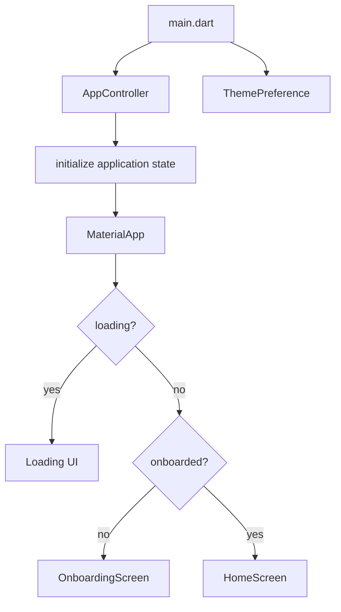
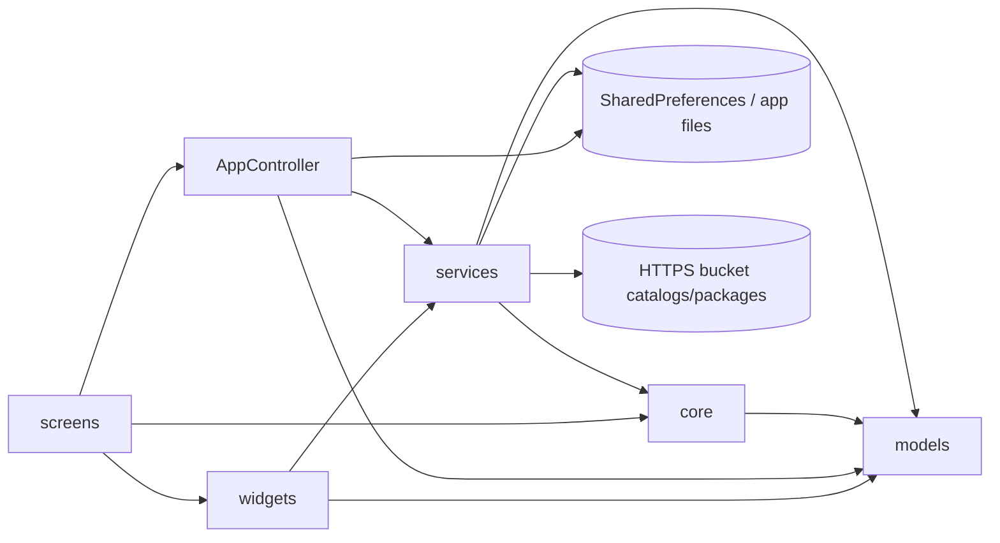

# Current Codebase Overview

This document describes the structure that exists in the current AnhPT codebase. It is intended as an implementation map for maintainers and AI agents, not as a target architecture.

## Runtime entry point

`lib/main.dart` creates a single `AppController`, initializes application state and theme preferences, then builds `AnhPtApp`. The root widget switches between loading, onboarding, and `HomeScreen` according to controller state.

## Main source directories

| Path | Current responsibility |
| --- | --- |
| `lib/app/` | Application-level state and preferences. `AppController` coordinates most user-facing data mutations and services. |
| `lib/core/` | Low-level domain/runtime logic that is independent from screens. Currently includes duration parsing and the workout `SessionEngine`. |
| `lib/models/` | Persisted/domain models for workouts, drafts, buckets, health, profiles, recordings, music, and media assets. |
| `lib/services/` | Persistence, parsing/serialization, audio, media, packages, bucket networking, health analytics and other infrastructure. |
| `lib/screens/` | Material UI screens and feature orchestration. |
| `lib/widgets/` | Reusable UI pieces for recordings, media demonstrations, profile editing, music configuration, and workout presentation. |
| `lib/data/` | Bundled sample workout data used to seed a fresh installation. |

## Current dependency shape

The codebase follows a pragmatic layered structure rather than a strict clean-architecture split.

`AppController` is the main application coordinator. It owns in-memory lists such as workouts, music tracks, bucket sources/catalog entries, installed bucket provenance, and legacy recording/music maps. It also delegates to specialized services such as `LocalStore`, `WorkoutParser`, `WorkoutSerializer`, `WorkoutPackageService`, `WorkoutBucketService`, `LocalMediaRepository`, `MusicLibraryService`, and `CoachRecordingService`.

## Main screens

The current `lib/screens/` directory contains:

| Screen | Responsibility |
| --- | --- |
| `home_screen.dart` | Main application hub and workout list/filtering entry point. |
| `workout_detail_screen.dart` | Inspect a workout, adjust workout-level options, view steps, update bucket workouts, and start a session. |
| `workout_builder_screen.dart` | Structured workout creation/editing experience. |
| `workout_editor_screen.dart` | YAML-oriented workout editing. |
| `workout_player_screen.dart` | Runs a workout using `SessionEngine`, voice/audio services, music, and device actions. |
| `workout_download_screen.dart` | Browse downloadable workouts. |
| `bucket_catalog_screen.dart` | Browse a bucket catalog and installation state. |
| `bucket_sources_screen.dart` | Manage external bucket catalog sources. |
| `health_screen.dart` | Health dashboard, profile data and weight measurements. |
| `local_profiles_screen.dart` | Manage local user profiles and the active profile. |
| `music_library_screen.dart` | Manage local/bundled background music. |
| `settings_screen.dart` | Application settings entry point. |
| `onboarding_screen.dart` | First-run onboarding. |

## State ownership

There are two important `ChangeNotifier` state owners:

- `AppController`: long-lived application state and persisted user data.
- `SessionEngine`: short-lived state for one running workout session.

Other controllers/services are scoped to a feature or session. For example `VoiceGuideController` reacts to `SessionEngine` changes and manages announcements without owning session progression itself.

## Architectural rule for changes

When changing code, prefer placing behavior according to current ownership:

- workout timing/progression -> `SessionEngine`
- workout data shape -> `models/workout.dart`
- YAML validation -> `WorkoutParser`
- YAML output -> `WorkoutSerializer`
- persisted application collections/preferences -> `LocalStore` or `HealthStore`
- application-wide mutation/orchestration -> `AppController`
- voice timing and spoken cues -> `VoiceGuideController` / `AudioFeedbackService`
- background music playback -> `BackgroundMusicService`
- bucket catalog/network behavior -> `WorkoutBucketService`
- package import/export -> `WorkoutPackageService`
- screen-specific presentation -> corresponding file in `lib/screens/`

Do not add unrelated responsibilities to `SessionEngine`; it should remain focused on deterministic session state and time progression.
