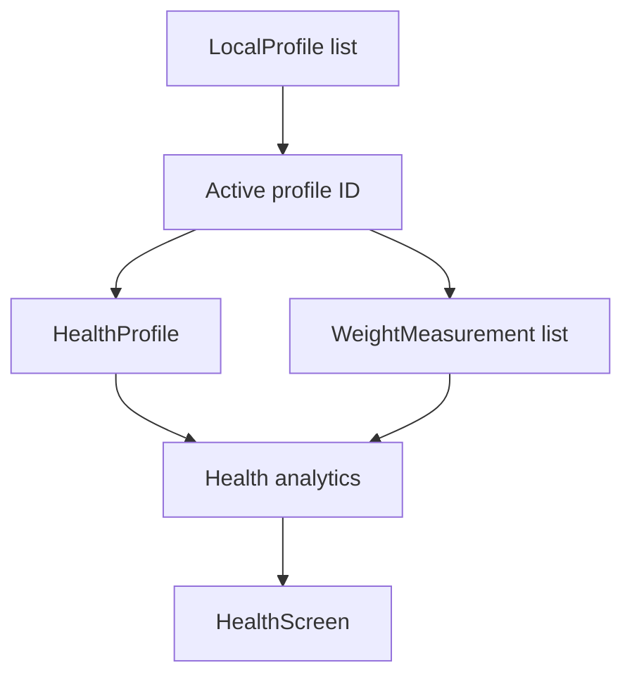
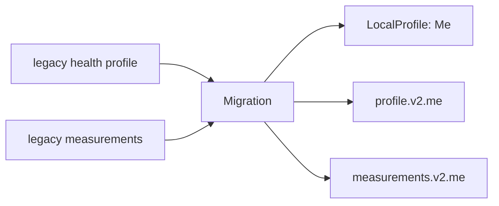

# Health and Local Profiles

Health data is stored locally and scoped to an active local profile. `HealthStore` owns persistence and migration; health screens and reusable profile widgets provide the UI.

## Data ownership



The local profile identity (`LocalProfile`) is separate from health attributes (`HealthProfile`). This lets a profile exist even when it has no health data.

## Local profiles

`HealthStore` guarantees at least one local profile after migration. A profile has its own ID, display name, optional avatar data and creation timestamp.

Supported operations include:

- list profiles
- resolve the active profile
- switch active profile
- create profile
- update/rename profile
- check whether a profile has health data
- delete a profile, as long as at least one profile remains

If the active profile is deleted, another remaining profile becomes active automatically.

## Per-profile health storage

Health data keys are namespaced by profile ID:

```text
anhpt.health.profile.v2.<profileId>
anhpt.health.measurements.v2.<profileId>
```

This prevents measurements from different people from sharing the same history.

## Migration from the original single profile

`HealthStore.ensureMigrated()` handles the legacy single-profile layout. If no multi-profile data exists, it creates a default local profile named `Me`, copies legacy health profile/measurement JSON into that profile, sets it active, then marks migration complete.



The migration is guarded by a persistent flag and is designed to be safe on repeated startup.

## Health profile

`HealthProfile` stores the profile-level values used for calculations and presentation, such as sex, birth year, height and unit system. The profile can remain partially unspecified.

`profileHasHealthData()` considers both measurement history and meaningful profile fields when deciding whether deleting/switching a profile may affect existing data.

## Weight measurements

Measurements are loaded as `WeightMeasurement` records and sorted newest first. The store tolerates an individual malformed legacy/imported record instead of rejecting the complete history.

Loaded weights are filtered to a basic valid range (`> 0` and `< 500 kg`) before being returned to the UI.

## Analytics

`lib/services/health_analytics.dart` contains derived health calculations. Keep calculations out of widgets where possible so screens remain focused on state and presentation.

## Active profile rule

Features that need health identity should resolve the active local profile through `HealthStore` rather than introducing an independent per-feature user selector. This keeps workout/health behavior consistent with one application-level active identity.

## Privacy boundary

The current health implementation is local persistence using `SharedPreferences`. There is no remote account synchronization in this layer. Any future cloud sync should be introduced explicitly rather than changing `HealthStore` semantics invisibly.
