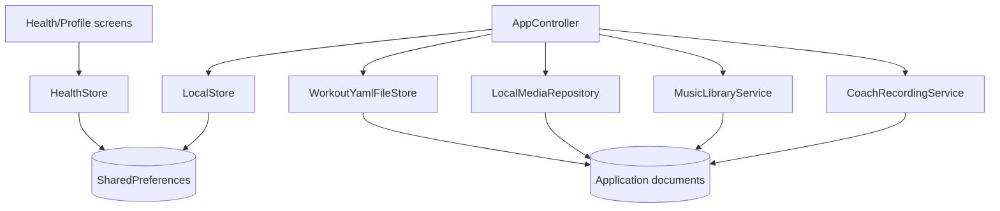
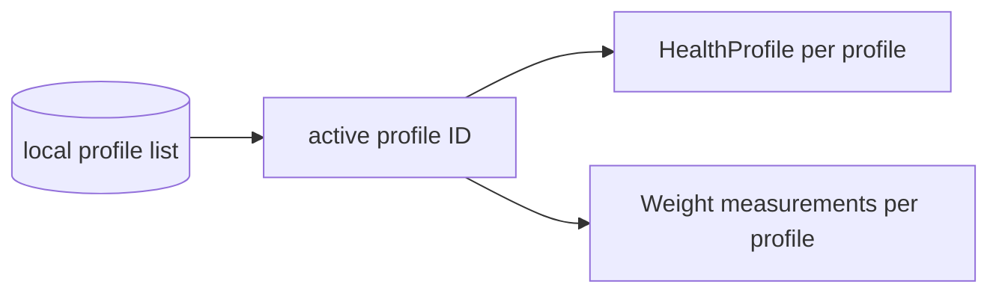
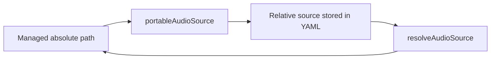

# Storage, Audio and Media

AnhPT is currently local-first. Structured application data is primarily persisted with `SharedPreferences`, while recordings, imported music, exported/imported workout packages, YAML mirrors and demonstration media use the local file system where supported.

## Persistence overview

## `LocalStore`

`LocalStore` persists general application state in `SharedPreferences`. Current groups include:

- workouts
- editor draft
- onboarding flag
- default voice language
- legacy coach-recording map
- imported music-track metadata
- legacy workout-music map
- bucket sources and cached catalog JSON
- installed bucket provenance
- quick-filter tag order and hidden tags
- IDs of workouts the user has already seen

Workouts are persisted using `Workout.toJson()`. This means local state includes both YAML-derived fields and app metadata such as favorite and usage timestamps.

`LocalStore.loadBucketSources()` also seeds the official AnhPT bucket once, using the configured GitHub raw catalog URL.

## `HealthStore`

Health/profile persistence is deliberately separate from `LocalStore`. It supports multiple local profiles and namespaces health data by profile ID.

The store contains a migration path from the original single-profile keys to the current multi-profile keys. On a fresh/migrated installation it ensures at least one local profile exists.

## File references in workout YAML

Recording and background-music fields do not persist arbitrary absolute filesystem paths. The parser accepts either:

- `asset:` references; or
- safe relative paths without absolute roots or `..` traversal.

`AppController.portableAudioSource()` converts managed files under the application documents directory to portable relative paths. `resolveAudioSource()` converts those references back to usable runtime paths.

This is important for package portability and for moving application document roots between platforms/installations.

## Coach recordings

Coach recordings may be attached to:

- the workout description/introduction; or
- an individual step.

The current model stores these references directly in the workout YAML/model. `CoachRecordingService` manages readable file names. `AppController` contains migrations from older separately persisted recording assignments into the current workout-owned references.

At runtime, `VoiceGuideController` attempts the local recording first and falls back to TTS if the recording is missing or cannot be played.

## Background music

Background music has two related concepts:

1. `MusicTrack`: an item in the local/bundled music library.
2. `BackgroundMusicConfig`: the selected source and playback configuration stored on a workout.

Imported personal tracks are copied/moved into the managed music library. Bundled tracks are referenced as assets. `AppController` contains migration logic that normalizes older music paths and legacy workout-music assignments.

## Demonstration media

`LocalMediaRepository` owns imported demonstration images/animations/videos. `AppController.importDemoMedia()` currently:

- does not support local import on Web;
- uses the camera video picker on Android;
- uses a file picker on other supported targets;
- accepts common video/image/GIF formats;
- rejects files larger than 20 MB.

A workout step references an `Exercise`, and the exercise references demonstration media. This enables reuse and keeps the step data itself small.

## YAML file mirror

`WorkoutYamlFileStore` is optional in `AppController`. When available, controller initialization calls `replaceAll(workouts)`, and workout save/delete operations keep the YAML file representation synchronized with the persisted workout collection.

The in-memory `Workout` list remains the active application model; the YAML file store is a synchronized representation, not a second independent source of truth.

## Migration behavior

`AppController.initialize()` currently runs several compatibility migrations after loading persisted state:

- legacy audio assignments -> recording/music references stored in workouts
- recording files -> readable managed file names
- music paths -> managed portable paths
- demonstration-media references -> current path representation

Migration code should remain idempotent: startup can run it repeatedly without changing already-normalized data.
