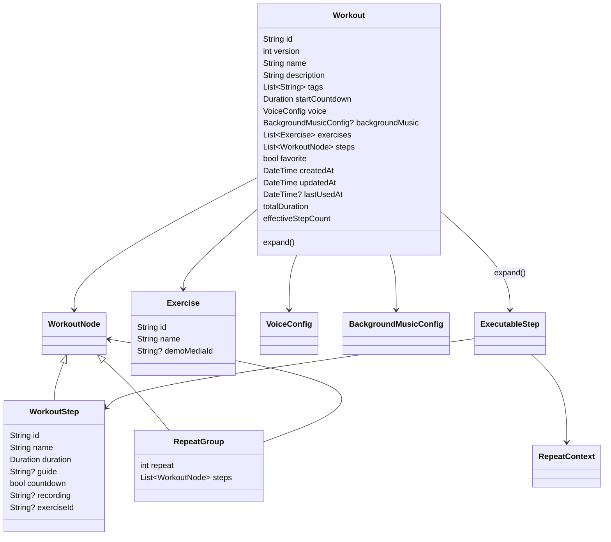
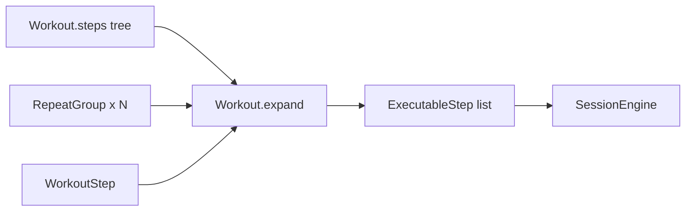
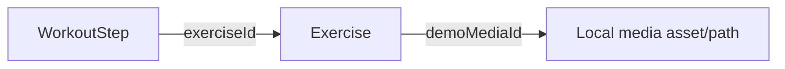
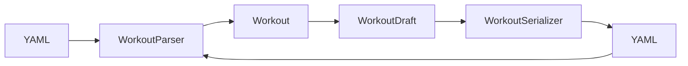

# Workout Domain Model

The workout domain is centered on `lib/models/workout.dart`. YAML is parsed into this model, the UI edits a mutable `WorkoutDraft`, and persisted workouts are stored as JSON-compatible model data plus the original YAML text.

## Core model



## Tree model and expansion

A workout stores its program as a tree of `WorkoutNode` values. A node is either a concrete `WorkoutStep` or a `RepeatGroup`, which may contain more steps or nested repeat groups.

Before execution, `Workout.expand()` flattens the tree into `ExecutableStep` values. Each executable item receives a stable path-like `stepKey` such as `0`, `1.0`, or `2.1.0`. Non-nested repeat groups can also produce a `RepeatContext` so the voice layer can announce round information.



The calculated `totalDuration` and `effectiveStepCount` recursively include repeat multiplication.

## Voice configuration

`VoiceConfig` uses independent timing flags rather than one combined mode:

- `announceElapsedTime`
- `announceInterval`
- `announceFinalCountdown`
- `announceEvery`
- `countdownFrom`
- `announceStepName`
- `announceStart`
- `announceFinish`

This allows interval announcements, elapsed-time speech, and final countdown to be enabled independently.

## Exercise and demonstration media relationship

A `WorkoutStep` may point to an `Exercise` through `exerciseId`. The `Exercise` then carries `demoMediaId`. This indirection allows multiple workout steps to reuse one exercise/media definition.



`AppController.assignStepDemoMedia()` creates or updates an exercise entry for the selected step and stores the media reference. Removing media clears the step reference and deletes an unused exercise definition.

## YAML boundary

`WorkoutParser` is the authoritative validation boundary for YAML input. It currently accepts schema versions `1` and `2`, rejects unknown fields, validates durations and limits, and builds the immutable `Workout` model.

Important parser limits include:

- at least one workout step
- maximum repeat nesting depth: 10
- repeat count: 1..10,000
- effective step count: at most 100,000
- total workout duration: at most 24 hours
- voice language: `vi` or `en`
- safe recording/music sources: `asset:` references or safe relative paths

The current voice YAML shape is conceptually:

```yaml
voice:
  language: en
  announce_step_name: true
  announce_start: true
  announce_finish: true
  timing:
    elapsed_time: false
    interval: true
    interval_every: 10s
    final_countdown: true
    countdown_from: 5s
```

`WorkoutSerializer` performs the reverse operation for structured editing: a `WorkoutDraft` is serialized to YAML, then reparsed through `WorkoutParser` before becoming a saved `Workout`. This keeps structured UI edits subject to the same validation rules as imported YAML.



## Persistence representation

`Workout.toJson()` persists runtime/user metadata that is not purely YAML content, including favorite state and timestamps. The model also stores `rawYaml`, so the application can retain and regenerate the source representation while still loading quickly from local persistence.
