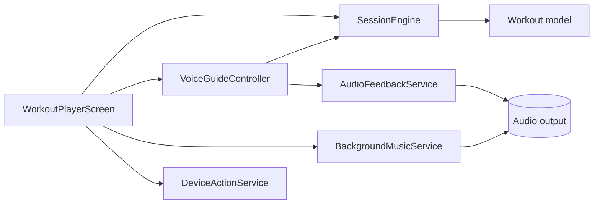
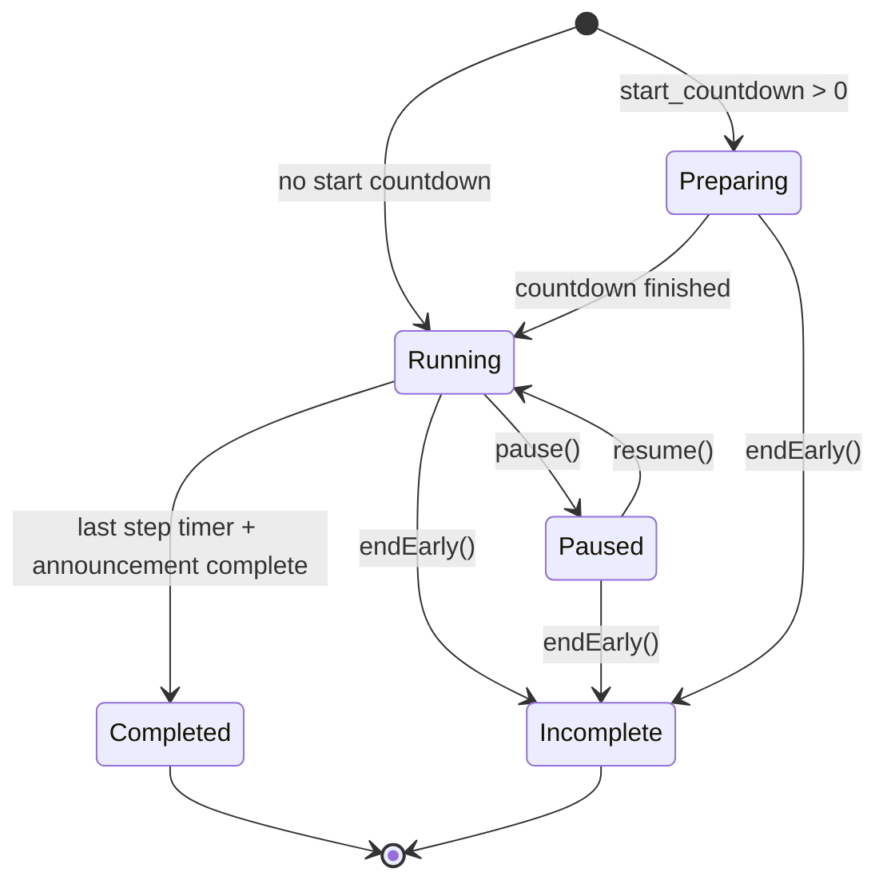
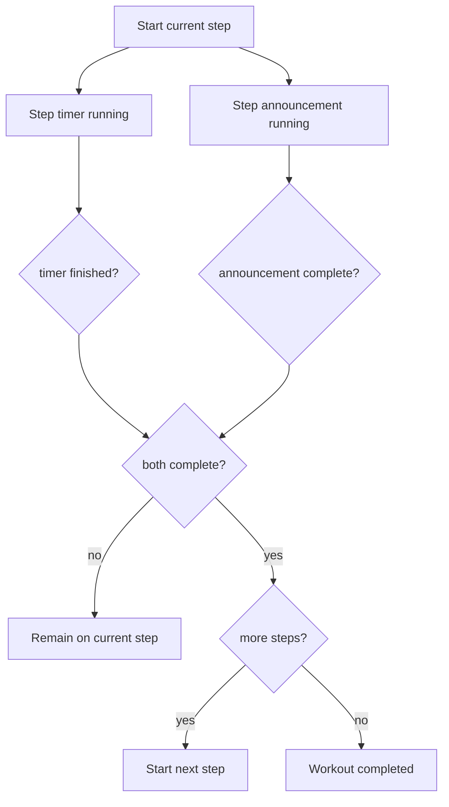
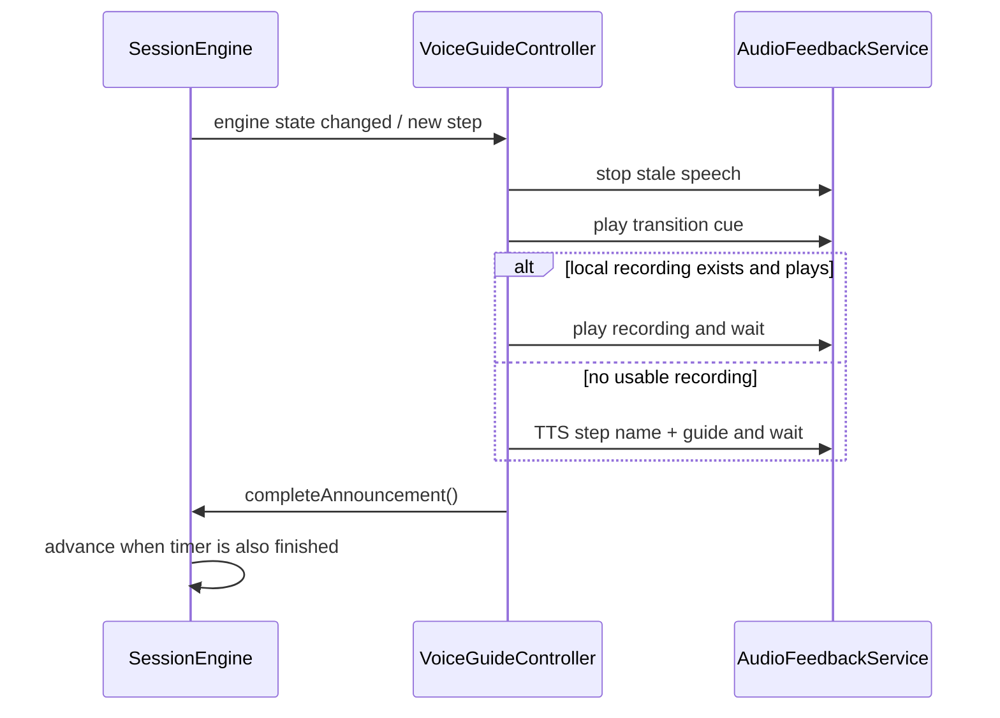

# Workout Runtime

A running workout is intentionally split into session state, voice/audio orchestration, background music, and screen presentation.

## Runtime participants

`SessionEngine` owns progression. `VoiceGuideController` observes the engine and reports when the current step announcement has completed. Voice failure is not allowed to permanently block progression.

## Session state machine

`SessionEngine` is a `ChangeNotifier` with these states:

The engine expands the workout tree once in its constructor. Each session therefore executes a flat list of `ExecutableStep` values while preserving repeat context where applicable.

## Two-condition step completion

A key implementation detail is that step progression requires **both**:

1. the step timer has finished; and
2. the step name/guide announcement has finished.

This allows a short step to finish its timer while a longer spoken guide is still playing. The engine waits instead of cutting the announcement off or prematurely advancing.

## Timing implementation

The engine uses `Stopwatch` instances for preparation, current-step time, and total active time. A periodic timer evaluates state every 100 ms. Pause stores elapsed values and stops the active stopwatches; resume restarts them.

`activeElapsed` intentionally excludes paused time. `progress` is derived from active elapsed time divided by the workout's calculated total duration.

## Voice lifecycle

`VoiceGuideController` reacts to engine changes and handles:

- workout start/description announcement
- step transition cue
- step name and guide
- local coach recording with TTS fallback
- round announcements for repeat contexts
- pause/resume phrases
- elapsed-time speech
- periodic remaining-time speech
- final countdown
- workout completion phrase
- muting and cancellation of stale async speech

The controller uses a generation counter to invalidate async callbacks after mute, cancellation, pause-related replay, or disposal. This avoids a stale speech completion affecting a newer step.

## Voice timing precedence

Timing announcements begin only after the step announcement is complete. For a given tick, the current precedence is:

1. final countdown, when enabled and inside `countdownFrom`;
2. periodic remaining-time announcement, when enabled and on an interval boundary;
3. elapsed-time announcement, when enabled.

This prevents interval/countdown speech from interrupting the initial step name or guide.

## Muting

Muting cancels current voice audio. If a step announcement was still pending, the controller marks it complete so voice muting cannot stall the workout engine. Transition cue behavior remains separately controlled by workout sound configuration.

## Background music

Background music is a separate responsibility from coach speech. Workout-level `BackgroundMusicConfig` contains source, enabled state, base volume and ducking mode. `BackgroundMusicService` owns playback/looping behavior, while the voice/audio layer can coordinate ducking around coach output.

The architectural reason for the separation is that muting coach guidance should not imply disabling background music, and background music lifecycle should follow session pause/resume/end rather than individual speech requests.

## Player responsibilities

`WorkoutPlayerScreen` is the integration layer for a live session. It should remain responsible for UI and wiring rather than becoming the owner of timing rules. Changes to progression belong in `SessionEngine`; changes to spoken behavior belong in `VoiceGuideController` or `AudioFeedbackService`.
