# AnhPT Project Management Guide

This document describes how AnhPT uses GitHub Issues, labels, Projects, branches, pull requests, CI, testing, and releases to manage development work.

## Overview

AnhPT uses three GitHub Projects with separate responsibilities:

- **Roadmap** — medium- and long-term planning.
- **Sprint Board** — active implementation work.
- **Bug Tracking** — defect investigation and verification.

The same issue may appear in more than one Project when useful. For example, a major feature can remain visible in the Roadmap while its implementation work is tracked in the Sprint Board.

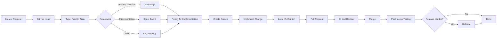

## Choosing the Right Project

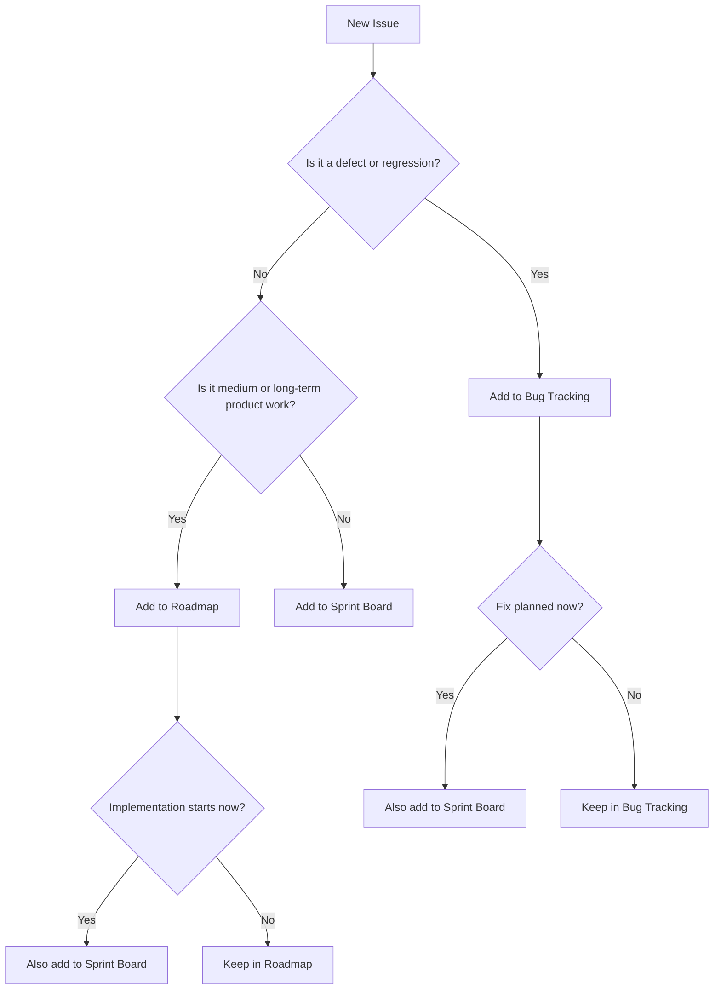

## Roadmap Workflow

The Roadmap answers: **What should AnhPT build, improve, or investigate over time?**

Use it for major features, architecture changes, product initiatives, and release goals. Avoid filling the Roadmap with small implementation tasks.

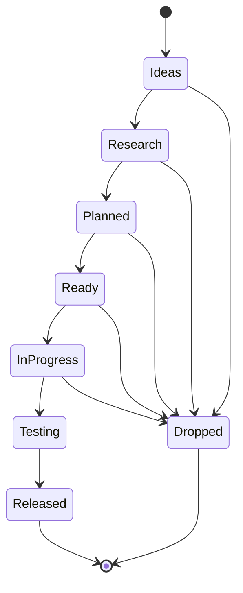

### Roadmap status meanings

| Status | Meaning |
| --- | --- |
| `Ideas` | Interesting idea that has not yet been evaluated. |
| `Research` | Product or technical investigation is in progress. |
| `Planned` | Approved for future development. |
| `Ready` | Defined well enough to begin implementation. |
| `In Progress` | Implementation is actively underway. |
| `Testing` | Implementation exists and is being verified. |
| `Released` | Available in an AnhPT release. |
| `Dropped` | Intentionally abandoned or no longer relevant. |

## Sprint Board Workflow

The Sprint Board answers: **What are we actively working on now or next?**

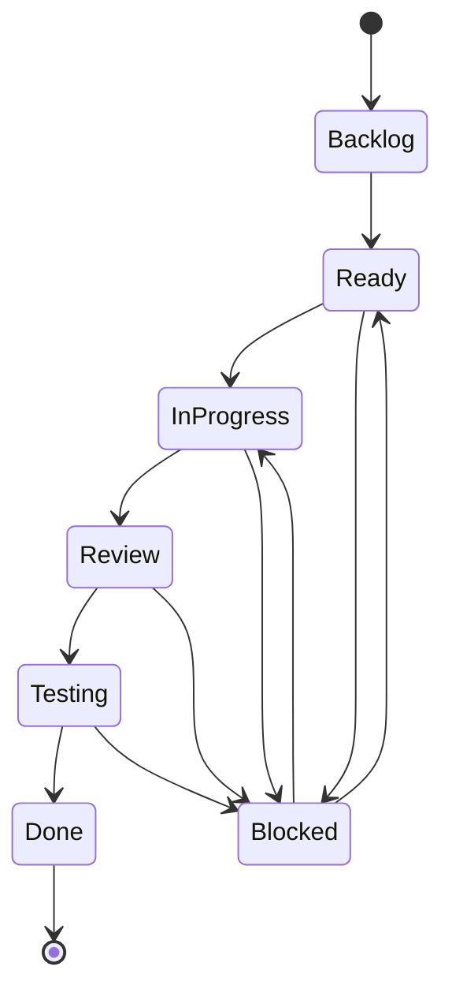

### Sprint status meanings

| Status | Meaning |
| --- | --- |
| `Backlog` | Known work that is not yet scheduled. |
| `Ready` | Clear scope and acceptance criteria; implementation can start. |
| `In Progress` | Code or documentation is actively being changed. |
| `Review` | A pull request is open or implementation is awaiting review. |
| `Testing` | The merged or completed change is being verified. |
| `Blocked` | Progress cannot continue because of a dependency or unresolved problem. |
| `Done` | Implementation and required verification are complete. |

## Bug Tracking Workflow

The Bug Tracking project answers: **What is broken, how severe is it, and has the fix been verified?**

Severity and priority are intentionally separate:

- **Severity** describes impact.
- **Priority** describes how soon the issue should be handled.

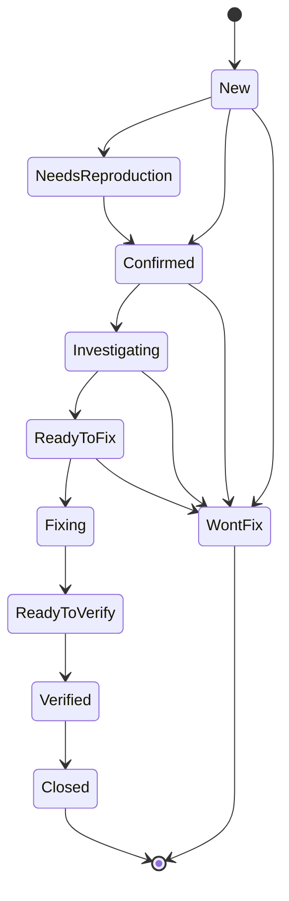

### Bug status meanings

| Status | Meaning |
| --- | --- |
| `New` | Newly reported defect. |
| `Needs Reproduction` | More information or reliable reproduction steps are needed. |
| `Confirmed` | The problem has been reproduced or otherwise validated. |
| `Investigating` | Root cause is being identified. |
| `Ready to Fix` | Root cause or implementation direction is sufficiently understood. |
| `Fixing` | A fix is actively being implemented. |
| `Ready to Verify` | A proposed fix exists and needs verification. |
| `Verified` | The fix has been successfully verified. |
| `Closed` | Bug lifecycle is complete. |
| `Won't Fix` | The problem is understood but will intentionally remain unresolved. |

## Development Workflow

Every significant implementation should normally start from an Issue and end with verification.

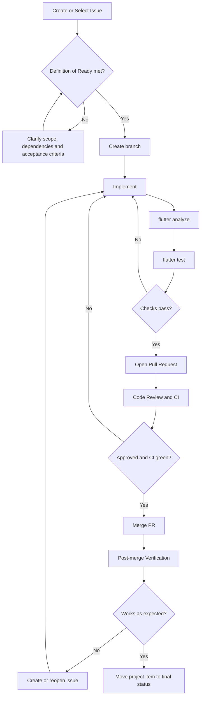

## Branch and Pull Request Conventions

Use short, descriptive branch names:

```text
feat/<short-description>
fix/<short-description>
refactor/<short-description>
docs/<short-description>
```

Use conventional pull request titles:

```text
feat: add ...
fix: correct ...
refactor: simplify ...
docs: document ...
```

Reference the related issue from the pull request where applicable:

```text
Closes #123
```

## Release Workflow

AnhPT uses pull request title prefixes as part of release automation. A merged PR beginning with `feat:` or `fix:` can trigger the Android release workflow.

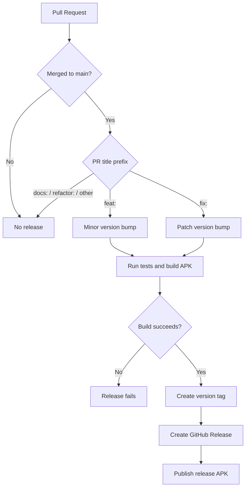

## Relationship Between the Three Projects

The Projects are different views of the same development system rather than isolated task lists.

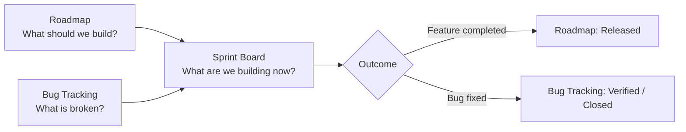

A typical major feature may therefore follow this path:

```text
Roadmap: Ideas -> Research -> Planned -> Ready
                         |
                         v
Sprint:               Ready -> In Progress -> Review -> Testing -> Done
                                                           |
                                                           v
Roadmap:                                                Testing -> Released
```

A typical bug fix may follow this path:

```text
Bug Tracking: New -> Confirmed -> Investigating -> Ready to Fix
                                             |
                                             v
Sprint:                                  Ready -> In Progress -> Review -> Testing -> Done
                                                                            |
                                                                            v
Bug Tracking:                                                   Ready to Verify -> Verified -> Closed
```

## Definition of Ready

An issue is ready for implementation when:

- The problem or objective is clear.
- Scope is sufficiently defined.
- Acceptance criteria are testable where applicable.
- Important dependencies are known.
- Major product or technical questions have been resolved.

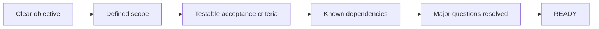

## Definition of Done

Work is done when:

- The implementation or documentation is complete.
- Relevant tests and verification steps pass.
- `flutter analyze` and `flutter test` pass when applicable.
- Documentation is updated if behavior or developer workflow changed.
- The pull request is merged.
- Required post-merge verification is complete.

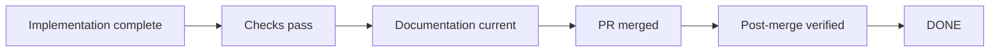

## Recommended End-to-End Lifecycle

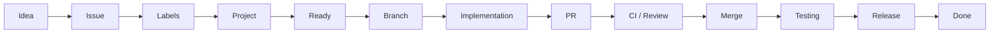

This lifecycle is a guideline rather than a rigid rule. Small documentation changes, emergency fixes, and exploratory work may use a shorter path, but the final state should always make it clear what changed, why it changed, and whether the result was verified.
