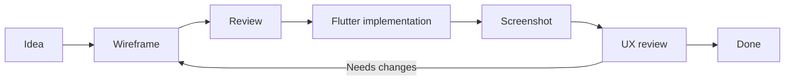

# AnhPT UI Wireframes

AnhPT uses text-based wireframes as a lightweight UI contract between the product owner and AI coding agents.

## Why text-based wireframes

- Versioned together with the source code.
- Easy to review in pull requests.
- Easy for AI agents to read and update.
- Fast to change before Flutter implementation begins.
- Keeps product intent separate from implementation details.

## Formats

Use Mermaid for navigation and screen-to-screen flows.
Use PlantUML Salt for the internal layout of individual screens.

## Workflow



## Wireframe files

- [`workout-detail.puml`](workout-detail.puml) — Workout Detail screen.

## Conventions

Wireframes describe structure, hierarchy, important controls, and interaction intent. They are not expected to be pixel-perfect representations of Flutter widgets.

When a UI change affects layout or interaction significantly:

1. Update the corresponding wireframe first.
2. Review the intended UX.
3. Implement the Flutter change.
4. Compare the running application with the wireframe.
5. Update the wireframe if the final accepted design differs.

## Rendering PlantUML Salt

A `.puml` file can be rendered with a PlantUML-capable IDE extension, the PlantUML CLI, or a compatible preview service.

Example with the PlantUML CLI:

```text
plantuml docs/ux/workout-detail.puml
```

The generated image is only a preview artifact. The `.puml` source remains the canonical wireframe stored in Git.
