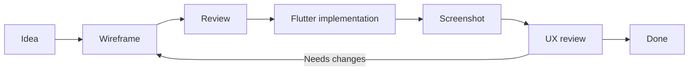

# AnhPT UI Wireframes

AnhPT uses text-based wireframes as a lightweight UI contract between the product owner and AI coding agents.

## Why text-based wireframes

- Versioned together with the source code.
- Easy to review in pull requests.
- Easy for AI agents to read and update.
- Fast to change before Flutter implementation begins.
- Keeps product intent separate from implementation details.

## Formats

Use Mermaid for navigation and screen-to-screen flows.
Use PlantUML Salt for the internal layout of individual screens.

## Workflow



## Wireframe gallery

### Workout Detail

Source: [`workout-detail.puml`](workout-detail.puml)  
Design notes: [`workout-detail-notes.md`](workout-detail-notes.md)


## Conventions

Wireframes describe structure, hierarchy, important controls, and interaction intent. They are not expected to be pixel-perfect representations of Flutter widgets.

When a UI change affects layout or interaction significantly:

1. Update the corresponding wireframe first.
2. Review the intended UX in this Markdown gallery or the screen-specific notes.
3. Implement the Flutter change.
4. Compare the running application with the wireframe.
5. Update the wireframe if the final accepted design differs.

## Rendering PlantUML Salt

The source of truth is the `.puml` file. GitHub Actions automatically renders PlantUML sources under `docs/` to SVG and commits the generated SVG files back to the repository.

For example:

```text
docs/ux/workout-detail.puml
        ↓
docs/ux/workout-detail.svg
        ↓
embedded in docs/ux/README.md and workout-detail-notes.md
```

The generated SVG is committed for convenient viewing and embedding, but changes should be made to the `.puml` source rather than editing the SVG directly.
