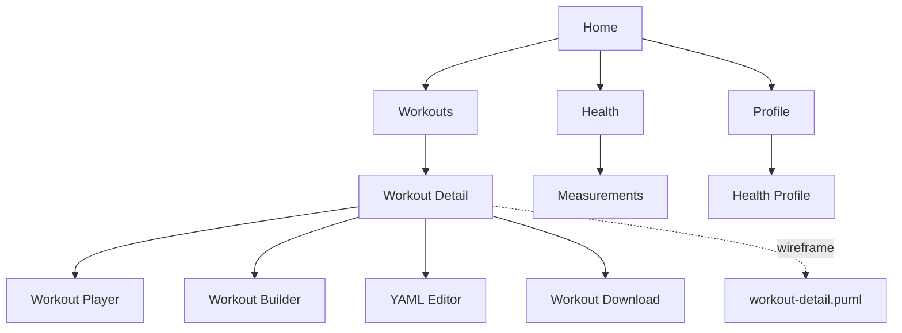

# AnhPT UI Navigation Map

This document shows the high-level relationship between the main AnhPT screens. Detailed screen layouts live in PlantUML Salt wireframes under this directory.

```mermaid
flowchart TD
    Home --> Workouts
    Home --> Health
    Home --> Profile

    Workouts --> WorkoutDetail[Workout Detail]
    WorkoutDetail --> WorkoutPlayer[Workout Player]
    WorkoutDetail --> WorkoutBuilder[Workout Builder]
    WorkoutDetail --> WorkoutEditor[YAML Editor]
    WorkoutDetail --> WorkoutDownload[Workout Download]

    Health --> Measurements
    Profile --> HealthProfile[Health Profile]

    WorkoutDetail -. wireframe .-> WorkoutDetailWireframe[workout-detail.puml]
```
