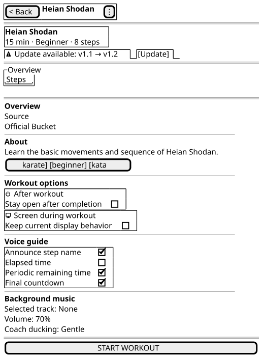

# Workout Detail Wireframe Notes

Canonical wireframe: [`workout-detail.puml`](workout-detail.puml)

## Preview

The SVG above is generated automatically from the canonical PlantUML source. Edit `workout-detail.puml`, not the SVG.

## Purpose

The Workout Detail screen lets the user inspect a workout, adjust workout-level playback options, inspect steps, update an installed bucket workout when a newer version exists, and start the workout.

## Current structure

The screen is organized into four persistent layers:

1. App bar with the workout name and overflow actions.
2. Compact workout summary header.
3. `Overview`, `Exercises · N`, and `Audio` tabs.
4. A prominent Start action in the app bar on wide layouts or at the bottom on narrow layouts.

An update banner appears between the summary header and tabs when a newer bucket version is available.

## Overview tab

The wireframe represents the main information hierarchy rather than every implementation detail:

- feature artwork with concise workout source when available
- compact description, tags, and playback metadata
- a preview of the first three executable steps
- a direct `View all N` route to the full Exercises tab
- workout-level options, arranged beside the preview on wide layouts and below it on narrow layouts

## Exercises tab

The `Exercises · N` tab contains the complete step and nested-repeat structure, including demonstration-media and recording interactions. `N` is the effective execution-step count.

## Audio tab

The Audio tab owns background-music selection, preview, volume, and ducking controls so these settings do not crowd the primary Overview journey.

## Design rule

The wireframe is the expected UX structure, not a pixel-perfect Flutter specification. If implementation and wireframe differ intentionally after UX review, update the wireframe so the accepted design remains documented.
